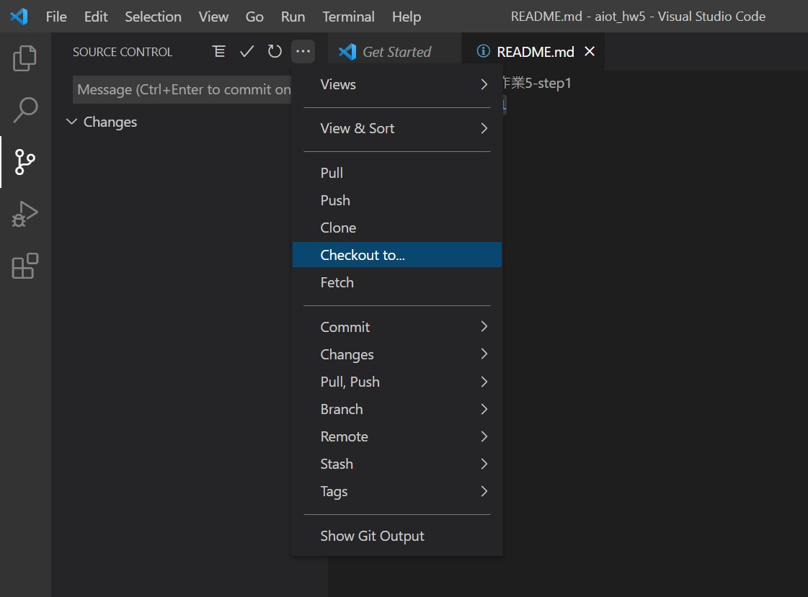

# 作業5-step1 安裝環境

## 1. 安裝 [visual studio code](https://code.visualstudio.com/)
## 2. 建立一個new repository (aiot_hw5)
## 3. 在visual studio 連結這個新創的repository
## 4. 建立一個新的branch，如這個step1 branch
[補充] 建立new branch的方法\


[補充] 跳到別的branch的方法\


## 5. vs code 安裝 python extension
## 6. pip install flask, pandas, sklearn
都安裝完，即可開始使用flask和machine learning

## 補充:
1. 連接github到vscode(要用新版的vs code)\
**[法1]**\
```	git clone: https://github.com/bettyteng21/1102-AIoT.git```
  
**[法2]**
```
echo "# 0517" >> README.md
	git init
	git add README.md
	git commit -m "first commit"
	git branch -M main
	git remote add origin https://github.com/huanchen1107/0517.git
	git push -u origin main
```
  
2. 在vs code安裝python extension module: ```pip install flask```
3. using google colab with github\
	[](https://colab.research.google.com/github/googlecolab/colabtools/blob/master/notebooks/colab-github-demo.ipynb)
4. run [老師寫的colab框架](https://github.com/huanchen1107/AIoT_2022)，即可用colab跑
