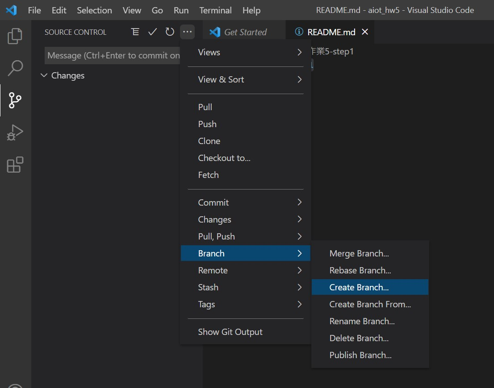

# 作業5-step1

1. 安裝 [visual studio code](https://code.visualstudio.com/)
2. 建立一個new repository (aiot_hw5)
3. 在visual studio 連結這個新創的repository
4. 建立一個新的branch，如這個step1 branch
  [補充] 建立new branch的方法
  
6. vs code 安裝 python extension
7. pip install flask, pandas, sklearn
