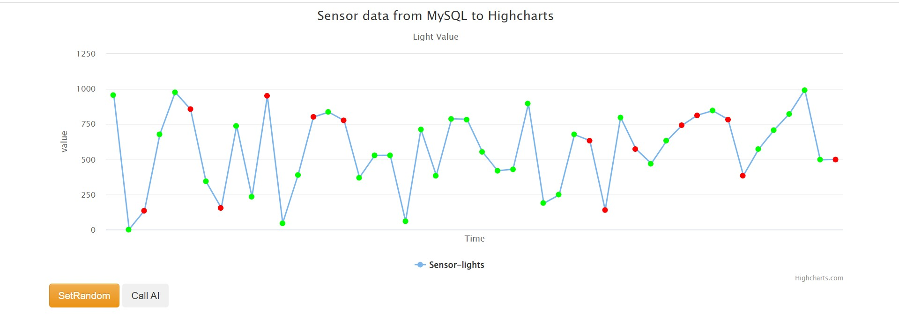

# 作業5-step4 使用flask呈現+隨機生成資料+ML

## 網頁結果
每次按下set random後都會是random的值(詳情請見step4的branch)\
之後再按下call AI，即可得到用我們import的model(myModel.pgz)判斷出的結果\
例子:\

這是按下set random後跑出來的隨機結果，紅點、綠點是隨機分配\

接下來按下call AI，結果如下，紅點、綠點會依照model去顯示\

