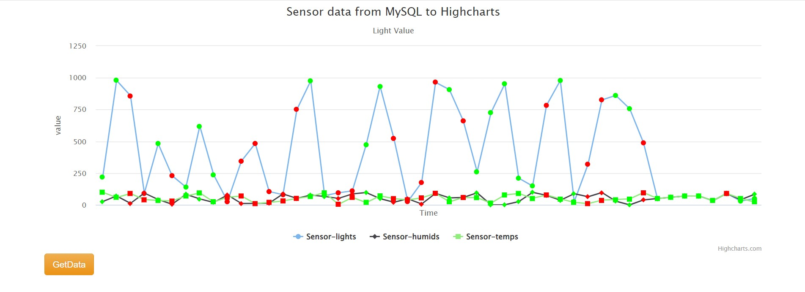

# 作業5-step3 使用flask來呈現database的資料 
尚未加上隨機生成與機器學習，單純使用flask去讀資料庫的資料

## 1.	建一個project folder
需包含:
1. python檔案
2. templates資料夾，裡面建一個index.html

## 2.	開始撰寫app.py
先連接資料庫，再指定要什麼資料，最後render到templates裡的index.html\
詳情請看app.py的註解

## 3.	撰寫index.html
修改老師之前PHP教案給的index.html，從flask取得資料後，直接把剛剛在資料庫拿到的資料放到data\
詳情請看index.html的註解

## 4. 網頁結果

將鼠標放在不同線上還可以凸顯該線條\

